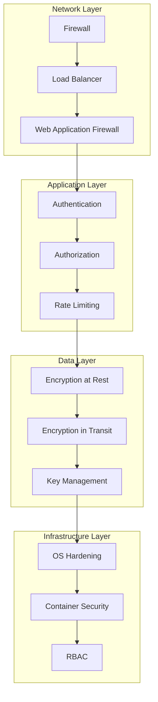

# Comprehensive Security Best Practices Guide

This guide provides detailed security recommendations for deploying and operating Vault Agent in production environments, covering encryption, access control, compliance, and operational security.

## Table of Contents

1. [Security Architecture Overview](#security-architecture-overview)
2. [Encryption and Key Management](#encryption-and-key-management)
3. [Access Control and Authentication](#access-control-and-authentication)
4. [Network Security](#network-security)
5. [Compliance and Audit](#compliance-and-audit)
6. [Operational Security](#operational-security)
7. [Incident Response](#incident-response)
8. [Security Monitoring](#security-monitoring)
9. [Vulnerability Management](#vulnerability-management)
10. [Security Checklist](#security-checklist)

## Security Architecture Overview

Vault Agent implements a zero-trust security model with multiple layers of protection:

### Defense in Depth Strategy



### Security Principles

1. **Zero Trust**: Never trust, always verify
2. **Least Privilege**: Minimal necessary access
3. **Defense in Depth**: Multiple security layers
4. **Fail Secure**: Secure defaults and failure modes
5. **Audit Everything**: Comprehensive logging and monitoring

## Encryption and Key Management

### Encryption at Rest

All secrets are encrypted using AES-256-GCM with customer-managed keys:

```yaml
# config.yaml
encryption:
  key_manager:
    type: "hsm"  # Recommended for production
    hsm:
      provider: "pkcs11"
      library_path: "/usr/lib/libpkcs11.so"
      slot_id: 0
      pin_file: "/etc/vault-agent/hsm-pin"
  
  # Alternative: File-based keys (less secure)
  # key_manager:
  #   type: "file"
  #   file:
  #     key_file: "/etc/vault-agent/keys/master.key"
  #     rotation_interval: "30d"
```

### Key Rotation Strategy

Implement automated key rotation:

```bash
#!/bin/bash
# key-rotation.sh

# Generate new encryption key
openssl rand -hex 32 > /tmp/new-master.key

# Rotate key in Vault Agent
vault-agent key rotate --new-key-file /tmp/new-master.key

# Verify rotation
vault-agent key status

# Secure cleanup
shred -vfz -n 3 /tmp/new-master.key
```

### Hardware Security Module (HSM) Integration

For maximum security, use HSM for key management:

```yaml
encryption:
  key_manager:
    type: "hsm"
    hsm:
      provider: "pkcs11"
      library_path: "/usr/lib/softhsm/libsofthsm2.so"
      slot_id: 0
      pin_file: "/etc/vault-agent/hsm-pin"
      key_label: "vault-agent-master-key"
      key_id: "0001"
```

### Cloud KMS Integration

For cloud deployments, integrate with cloud KMS:

```yaml
# AWS KMS
encryption:
  key_manager:
    type: "aws_kms"
    aws_kms:
      region: "us-west-2"
      key_id: "arn:aws:kms:us-west-2:123456789012:key/12345678-1234-1234-1234-123456789012"
      role_arn: "arn:aws:iam::123456789012:role/VaultAgentKMSRole"

# Azure Key Vault
encryption:
  key_manager:
    type: "azure_keyvault"
    azure_keyvault:
      vault_url: "https://vault-agent-kv.vault.azure.net/"
      key_name: "vault-agent-master-key"
      tenant_id: "12345678-1234-1234-1234-123456789012"
      client_id: "87654321-4321-4321-4321-210987654321"

# Google Cloud KMS
encryption:
  key_manager:
    type: "gcp_kms"
    gcp_kms:
      project_id: "your-project-id"
      location: "us-central1"
      key_ring: "vault-agent-keyring"
      key_name: "vault-agent-master-key"
```

## Access Control and Authentication

### Multi-Factor Authentication

Implement strong authentication mechanisms:

```yaml
authentication:
  methods:
    - "api_key"
    - "jwt"
    - "mtls"
    - "oidc"
  
  api_key:
    hash_rounds: 12
    min_length: 32
    expiration: "90d"
    rotation_required: true
  
  jwt:
    secret_file: "/etc/vault-agent/keys/jwt.key"
    expiration: "1h"
    issuer: "vault-agent"
    audience: "vault-api"
  
  mtls:
    ca_file: "/etc/vault-agent/tls/ca.crt"
    verify_client_cert: true
    require_client_cert: true
  
  oidc:
    issuer_url: "https://auth.yourdomain.com"
    client_id: "vault-agent"
    client_secret_file: "/etc/vault-agent/oidc-secret"
    scopes: ["openid", "profile", "email"]
```

### Role-Based Access Control (RBAC)

Define granular permissions:

```yaml
# rbac-policies.yaml
policies:
  - name: "admin"
    description: "Full administrative access"
    rules:
      - resource: "*"
        actions: ["*"]
        effect: "allow"
  
  - name: "developer"
    description: "Development environment access"
    rules:
      - resource: "secrets:development:*"
        actions: ["read", "create", "update"]
        effect: "allow"
      - resource: "secrets:production:*"
        actions: ["read"]
        effect: "allow"
    conditions:
      - type: "time_range"
        config:
          start: "09:00"
          end: "17:00"
          timezone: "UTC"
      - type: "ip_whitelist"
        config:
          allowed_ips: ["10.0.0.0/8", "192.168.1.0/24"]
  
  - name: "service-account"
    description: "Service-to-service access"
    rules:
      - resource: "secrets:production:service-*"
        actions: ["read"]
        effect: "allow"
    conditions:
      - type: "client_certificate"
        config:
          required_cn_pattern: "service-.*"
```

### API Key Management

Secure API key lifecycle:

```bash
#!/bin/bash
# api-key-management.sh

# Generate secure API key
API_KEY=$(openssl rand -hex 32)

# Create API key with expiration
vault-agent api-key create \
  --name "service-x-key" \
  --key "${API_KEY}" \
  --expires "2025-12-31T23:59:59Z" \
  --permissions "secrets:production:service-x:read"

# List API keys
vault-agent api-key list

# Rotate API key
vault-agent api-key rotate --name "service-x-key"

# Revoke API key
vault-agent api-key revoke --name "service-x-key"
```

## Network Security

### TLS Configuration

Implement strong TLS settings:

```yaml
server:
  tls:
    enabled: true
    cert_file: "/etc/vault-agent/tls/server.crt"
    key_file: "/etc/vault-agent/tls/server.key"
    ca_file: "/etc/vault-agent/tls/ca.crt"
    min_version: "1.3"
    max_version: "1.3"
    cipher_suites:
      - "TLS_AES_256_GCM_SHA384"
      - "TLS_CHACHA20_POLY1305_SHA256"
      - "TLS_AES_128_GCM_SHA256"
    prefer_server_cipher_suites: true
    session_tickets: false
    renegotiation: "never"
```

### Certificate Management

Automate certificate lifecycle:

```bash
#!/bin/bash
# cert-management.sh

# Generate certificate signing request
openssl req -new -key server.key -out server.csr \
  -subj "/CN=vault.yourdomain.com/O=YourOrg/C=US" \
  -config <(cat <<EOF
[req]
distinguished_name = req_distinguished_name
req_extensions = v3_req

[req_distinguished_name]

[v3_req]
basicConstraints = CA:FALSE
keyUsage = nonRepudiation, digitalSignature, keyEncipherment
subjectAltName = @alt_names

[alt_names]
DNS.1 = vault.yourdomain.com
DNS.2 = vault-agent.internal
IP.1 = 10.0.1.100
EOF
)

# Sign certificate with CA
openssl x509 -req -in server.csr -CA ca.crt -CAkey ca.key \
  -CAcreateserial -out server.crt -days 365 \
  -extensions v3_req -extfile <(cat <<EOF
[v3_req]
basicConstraints = CA:FALSE
keyUsage = nonRepudiation, digitalSignature, keyEncipherment
subjectAltName = @alt_names

[alt_names]
DNS.1 = vault.yourdomain.com
DNS.2 = vault-agent.internal
IP.1 = 10.0.1.100
EOF
)

# Verify certificate
openssl verify -CAfile ca.crt server.crt

# Check certificate expiration
openssl x509 -in server.crt -noout -dates
```

### Firewall Configuration

Implement network segmentation:

```bash
#!/bin/bash
# firewall-rules.sh

# Flush existing rules
iptables -F
iptables -X
iptables -t nat -F
iptables -t nat -X

# Default policies
iptables -P INPUT DROP
iptables -P FORWARD DROP
iptables -P OUTPUT ACCEPT

# Allow loopback
iptables -A INPUT -i lo -j ACCEPT

# Allow established connections
iptables -A INPUT -m state --state ESTABLISHED,RELATED -j ACCEPT

# Allow SSH from management network
iptables -A INPUT -p tcp --dport 22 -s 10.0.1.0/24 -j ACCEPT

# Allow Vault Agent API from application network
iptables -A INPUT -p tcp --dport 8200 -s 10.0.2.0/24 -j ACCEPT

# Allow Vault Agent web interface from admin network
iptables -A INPUT -p tcp --dport 8080 -s 10.0.1.0/24 -j ACCEPT

# Allow metrics from monitoring network
iptables -A INPUT -p tcp --dport 8201 -s 10.0.3.0/24 -j ACCEPT

# Allow database connections
iptables -A OUTPUT -p tcp --dport 5432 -d 10.0.4.100 -j ACCEPT

# Allow Redis connections
iptables -A OUTPUT -p tcp --dport 6379 -d 10.0.4.101 -j ACCEPT

# Log dropped packets
iptables -A INPUT -j LOG --log-prefix "DROPPED: "

# Save rules
iptables-save > /etc/iptables/rules.v4
```

## Compliance and Audit

### Audit Logging Configuration

Comprehensive audit logging:

```yaml
audit:
  enabled: true
  log_file: "/var/log/vault-agent/audit.log"
  log_format: "json"
  log_rotation:
    max_size: "100MB"
    max_files: 10
    max_age: "30d"
  
  events:
    - "secret_access"
    - "secret_create"
    - "secret_update"
    - "secret_delete"
    - "secret_rotate"
    - "authentication"
    - "authorization_failure"
    - "policy_change"
    - "configuration_change"
  
  sensitive_fields:
    - "secret_value"
    - "password"
    - "token"
  
  destinations:
    - type: "file"
      path: "/var/log/vault-agent/audit.log"
    - type: "syslog"
      facility: "local0"
      severity: "info"
    - type: "elasticsearch"
      url: "https://elasticsearch.yourdomain.com:9200"
      index: "vault-agent-audit"
```

### SOC 2 Compliance

Implement SOC 2 Type II controls:

```yaml
# soc2-controls.yaml
compliance:
  soc2:
    enabled: true
    controls:
      # Security
      - id: "CC6.1"
        description: "Logical and physical access controls"
        implementation:
          - "Multi-factor authentication required"
          - "Role-based access control implemented"
          - "Physical access to servers restricted"
      
      # Availability
      - id: "CC7.1"
        description: "System availability monitoring"
        implementation:
          - "24/7 monitoring implemented"
          - "Automated failover configured"
          - "SLA targets defined and monitored"
      
      # Processing Integrity
      - id: "CC8.1"
        description: "Data processing integrity"
        implementation:
          - "Input validation implemented"
          - "Data integrity checks performed"
          - "Error handling and logging"
      
      # Confidentiality
      - id: "CC9.1"
        description: "Data confidentiality protection"
        implementation:
          - "Encryption at rest and in transit"
          - "Access controls and monitoring"
          - "Data classification and handling"
      
      # Privacy
      - id: "CC10.1"
        description: "Personal information protection"
        implementation:
          - "Data minimization practices"
          - "Consent management"
          - "Data retention policies"
```

### GDPR Compliance

Data protection and privacy controls:

```yaml
gdpr:
  enabled: true
  data_protection:
    encryption: "AES-256-GCM"
    pseudonymization: true
    data_minimization: true
    purpose_limitation: true
  
  rights:
    access: true
    rectification: true
    erasure: true
    portability: true
    restriction: true
    objection: true
  
  breach_notification:
    enabled: true
    notification_period: "72h"
    contact: "dpo@yourdomain.com"
  
  data_retention:
    default_period: "7y"
    deletion_schedule: "monthly"
    verification_required: true
```

## Operational Security

### Secure Configuration Management

Use configuration management tools:

```yaml
# ansible-playbook.yml
- name: Configure Vault Agent Security
  hosts: vault_agents
  become: yes
  vars:
    vault_agent_user: vault-agent
    vault_agent_group: vault-agent
    config_dir: /etc/vault-agent
    data_dir: /var/lib/vault-agent
    log_dir: /var/log/vault-agent
  
  tasks:
    - name: Create vault-agent user
      user:
        name: "{{ vault_agent_user }}"
        system: yes
        shell: /bin/false
        home: "{{ data_dir }}"
        create_home: no
    
    - name: Create directories
      file:
        path: "{{ item }}"
        state: directory
        owner: "{{ vault_agent_user }}"
        group: "{{ vault_agent_group }}"
        mode: '0750'
      loop:
        - "{{ config_dir }}"
        - "{{ data_dir }}"
        - "{{ log_dir }}"
    
    - name: Set file permissions
      file:
        path: "{{ config_dir }}/config.yaml"
        owner: "{{ vault_agent_user }}"
        group: "{{ vault_agent_group }}"
        mode: '0600'
    
    - name: Configure firewall
      ufw:
        rule: allow
        port: "{{ item.port }}"
        src: "{{ item.src }}"
      loop:
        - { port: 8200, src: "10.0.2.0/24" }
        - { port: 8080, src: "10.0.1.0/24" }
        - { port: 8201, src: "10.0.3.0/24" }
```

### Container Security

Secure container deployment:

```dockerfile
# Dockerfile.secure
FROM alpine:3.18

# Create non-root user
RUN addgroup -g 65532 -S vault-agent && \
    adduser -u 65532 -S vault-agent -G vault-agent

# Install security updates
RUN apk update && apk upgrade && \
    apk add --no-cache ca-certificates && \
    rm -rf /var/cache/apk/*

# Copy binary
COPY --chown=vault-agent:vault-agent vault-agent /usr/local/bin/

# Set permissions
RUN chmod +x /usr/local/bin/vault-agent

# Create directories
RUN mkdir -p /data /config /logs && \
    chown -R vault-agent:vault-agent /data /config /logs

# Switch to non-root user
USER vault-agent

# Security labels
LABEL security.non-root=true
LABEL security.readonly-rootfs=true

# Health check
HEALTHCHECK --interval=30s --timeout=10s --start-period=60s --retries=3 \
  CMD /usr/local/bin/vault-agent health || exit 1

EXPOSE 8200 8080 8201

ENTRYPOINT ["/usr/local/bin/vault-agent"]
CMD ["server", "--config", "/config/config.yaml"]
```

### Secrets Management in CI/CD

Secure secrets in pipelines:

```yaml
# .github/workflows/deploy.yml
name: Deploy Vault Agent
on:
  push:
    branches: [main]

jobs:
  deploy:
    runs-on: ubuntu-latest
    environment: production
    
    steps:
    - uses: actions/checkout@v3
    
    - name: Configure AWS credentials
      uses: aws-actions/configure-aws-credentials@v2
      with:
        role-to-assume: ${{ secrets.AWS_ROLE_ARN }}
        aws-region: us-west-2
    
    - name: Get secrets from AWS Secrets Manager
      uses: aws-actions/aws-secretsmanager-get-secrets@v1
      with:
        secret-ids: |
          vault-agent/database-password
          vault-agent/redis-password
        parse-json-secrets: true
    
    - name: Deploy to EKS
      run: |
        helm upgrade vault-agent ./helm/vault-agent \
          --set postgresql.auth.password="${{ env.VAULT_AGENT_DATABASE_PASSWORD }}" \
          --set redis.auth.password="${{ env.VAULT_AGENT_REDIS_PASSWORD }}" \
          --wait
```

## Security Monitoring

### Security Information and Event Management (SIEM)

Integrate with SIEM systems:

```yaml
# siem-integration.yaml
monitoring:
  siem:
    enabled: true
    providers:
      - type: "splunk"
        config:
          url: "https://splunk.yourdomain.com:8088"
          token: "${SPLUNK_HEC_TOKEN}"
          index: "vault-agent"
          source: "vault-agent-audit"
      
      - type: "elastic"
        config:
          url: "https://elasticsearch.yourdomain.com:9200"
          index: "vault-agent-security"
          username: "vault-agent"
          password: "${ELASTIC_PASSWORD}"
      
      - type: "datadog"
        config:
          api_key: "${DATADOG_API_KEY}"
          site: "datadoghq.com"
          service: "vault-agent"
          tags: ["environment:production", "team:security"]
```

### Intrusion Detection

Monitor for suspicious activities:

```yaml
# ids-rules.yaml
intrusion_detection:
  enabled: true
  rules:
    - name: "Multiple failed authentication attempts"
      condition: "authentication_failure_count > 5 in 5m"
      action: "block_ip"
      severity: "high"
    
    - name: "Unusual access patterns"
      condition: "secret_access_count > 100 in 1m from same_ip"
      action: "alert"
      severity: "medium"
    
    - name: "Administrative action outside business hours"
      condition: "admin_action and (hour < 9 or hour > 17)"
      action: "alert"
      severity: "medium"
    
    - name: "Bulk secret access"
      condition: "secret_list_count > 50 in 1m"
      action: "rate_limit"
      severity: "low"
```

### Threat Intelligence Integration

Integrate threat intelligence feeds:

```yaml
threat_intelligence:
  enabled: true
  feeds:
    - type: "ip_reputation"
      url: "https://reputation.alienvault.com/reputation.data"
      update_interval: "1h"
    
    - type: "malware_domains"
      url: "https://malware-domains.com/files/domains.txt"
      update_interval: "6h"
    
    - type: "tor_exit_nodes"
      url: "https://check.torproject.org/api/bulk"
      update_interval: "1h"
  
  actions:
    - condition: "source_ip in malicious_ips"
      action: "block"
    
    - condition: "source_ip in tor_exit_nodes"
      action: "alert"
```

This comprehensive security guide provides the foundation for secure Vault Agent deployments. Continue with additional sections covering incident response, vulnerability management, and security checklists.